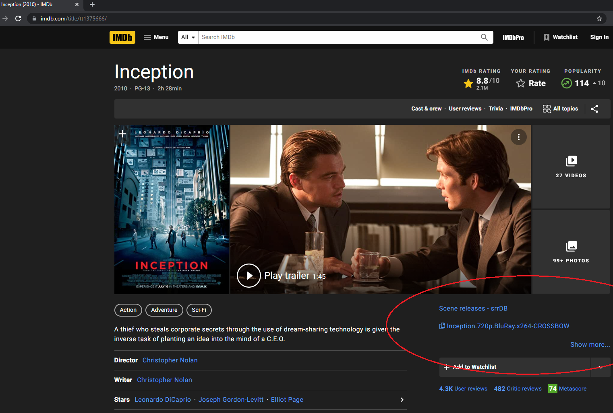
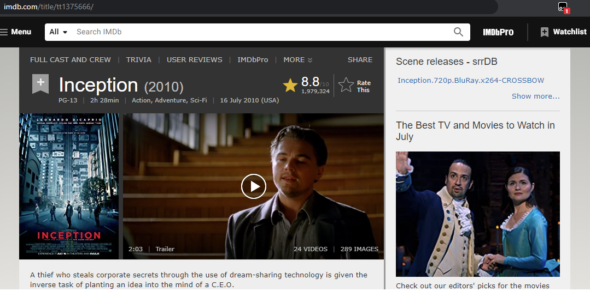
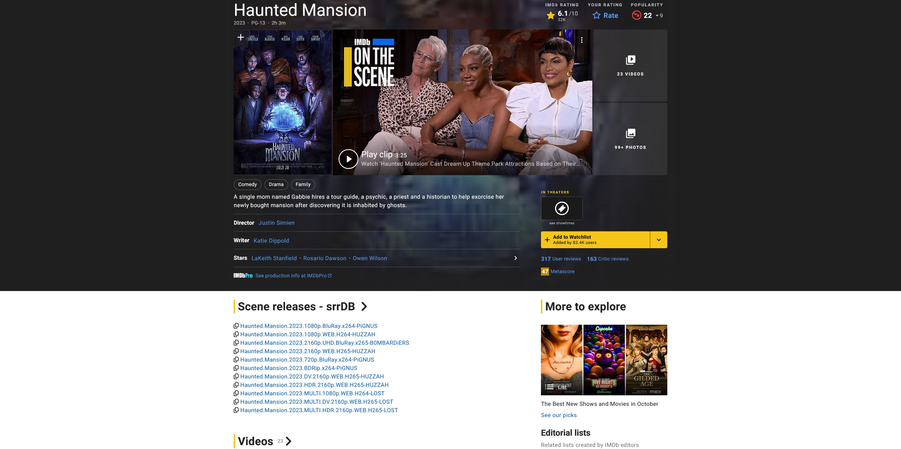
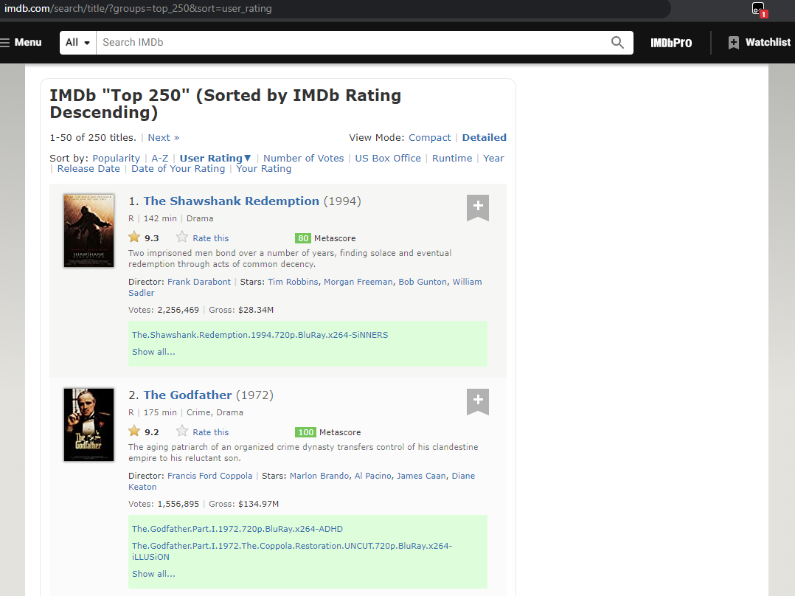
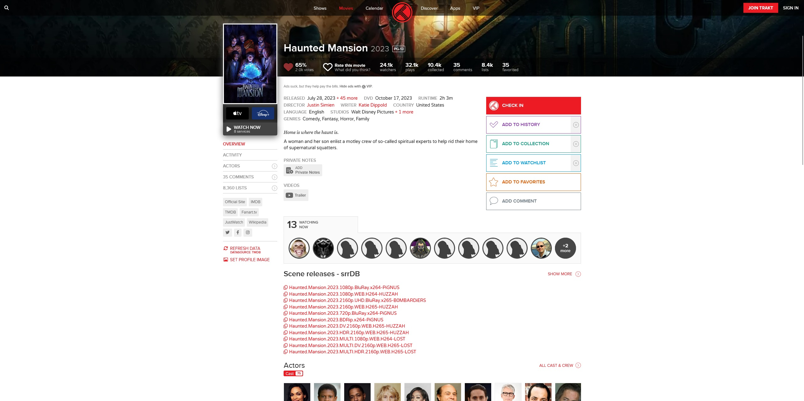
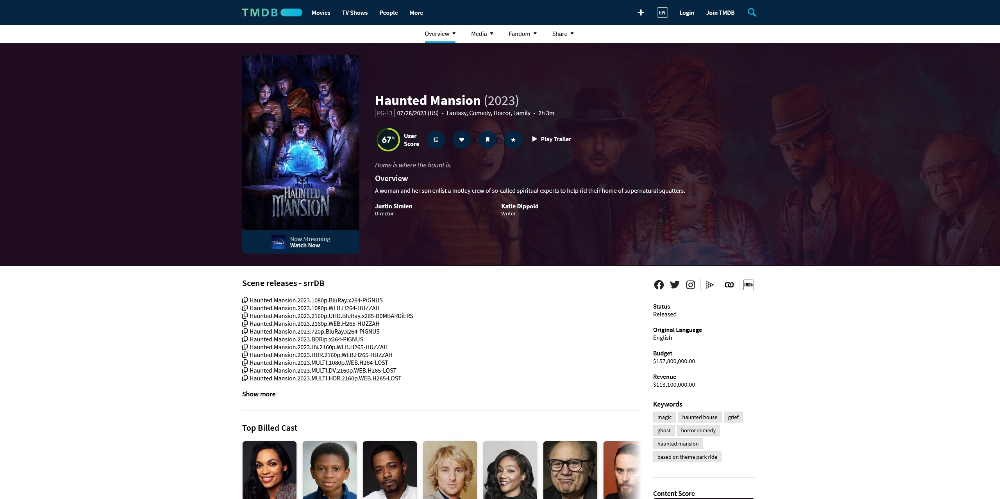

# srrextra

Collection of userscripts designed to integrate on various websites for easy scene release lookup using [srrDB API](https://www.srrdb.com/help#api)

## Compatible Websites

### [IMDb](https://www.imdb.com)

Screenshots

#### Single page

#### (Old design)

#### Single page - Alternative

#### Multiple page

### [Trakt](https://trakt.tv)

Screenshots

#### Single Movie

### [TMDB](https://www.themoviedb.org)

Screenshots

#### Single Movie

## Installation

Install your preferred userscript manager extension in your browser and add the desired scripts.

### Userscript manager extensions
- [Violentmonkey](https://violentmonkey.github.io/)⭐️
    - [Google Chrome](https://chrome.google.com/webstore/detail/violent-monkey/jinjaccalgkegednnccohejagnlnfdag)
    - [Mozilla Firefox](https://addons.mozilla.org/firefox/addon/violentmonkey/)
    - [Microsoft Edge](https://microsoftedge.microsoft.com/addons/detail/eeagobfjdenkkddmbclomhiblgggliao)
- [Tampermonkey](https://www.tampermonkey.net/)
    - [Google Chrome](https://chrome.google.com/webstore/detail/tampermonkey/dhdgffkkebhmkfjojejmpbldmpobfkfo)
    - [Mozilla Firefox](https://addons.mozilla.org/en-US/firefox/addon/tampermonkey/)
    - [Microsoft Edge](https://microsoftedge.microsoft.com/addons/detail/tampermonkey/iikmkjmpaadaobahmlepeloendndfphd)
    - [Safari](https://apps.apple.com/us/app/tampermonkey/id1482490089)
    - [Opera](https://addons.opera.com/en/extensions/details/tampermonkey-beta/)

The scripts may also be compatible with other browsers and plugins; if you find any additional compatibility, please let us know.