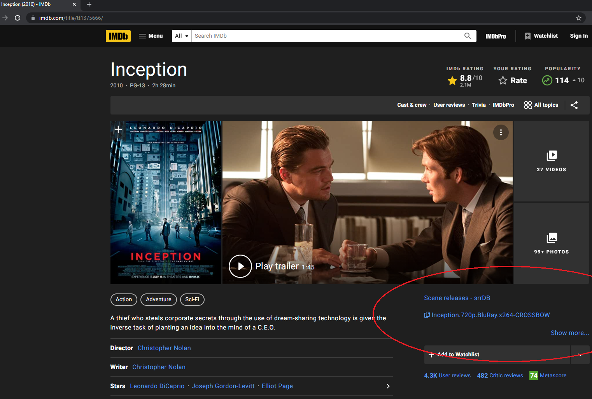
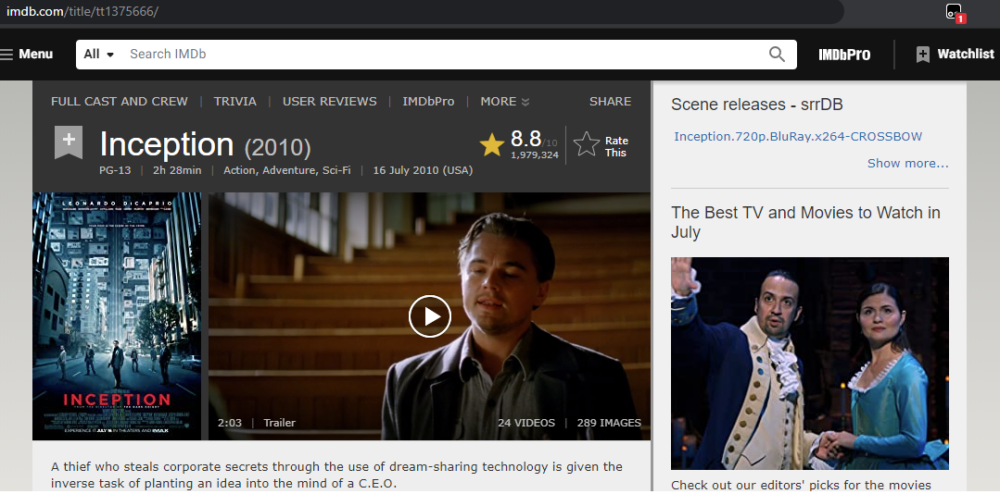

# srrextra

## Introduction
This is Tampermoneky scripts designed to integrate on IMDb for easy scene release lookup.

## Results

### Single page

#### (Old design)

### Multiple page

## Requirements
- Google Chrome
    - TemperMonkey plugin:
	https://chrome.google.com/webstore/detail/tampermonkey/dhdgffkkebhmkfjojejmpbldmpobfkfo?hl=en

## Installation
Install Chrome (or Firefox) with the Tampermonkey plugin. Then simple add the scripts you want.

It's possible the scripts also works for other browsers and plugins, please report back any more compatibility.
